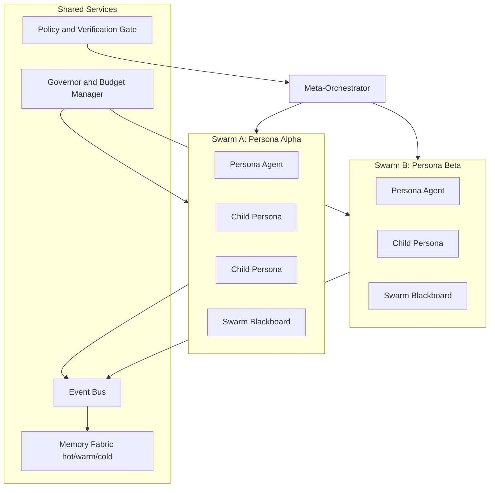

# Perpetual Persona Swarms

This document records the implementation plan for a larger architecture: many persistent persona agents, each running continuous cognition loops on separate `codetether-agent` swarms.

The design goal is logical continuity "ad infinitum" while keeping compute, safety, and coordination bounded.

## Vision

Move from request/response agents to a persistent cognition fabric:

- **Think continuously**: background reasoning loops run at all times
- **Speak/act on demand**: articulation and execution happen only at decision points
- **Scale by persona**: each persona can own an independent swarm
- **Coordinate globally**: swarms share intent through a meta-orchestrator

## Core Principles

1. **Thinking is separate from speaking**
2. **Every persona has isolated identity, memory, and policy**
3. **All execution is gated (proposal -> verification -> policy)**
4. **Infinity is logical, not unbounded resource usage**

## System Topology

## Agent Model

Each persona agent is a long-running unit with:

- **Identity**: stable persona id, role, and charter
- **Cognition loop**: observe -> reflect -> test -> compress
- **Memory namespace**: private by default, share by policy
- **Proposal interface**: emits intentions, never executes directly

## Recursion Model (Ad Infinitum with Hard Limits)

Child personas can spawn additional personas, but only under strict invariants:

- **Max spawn depth**: upper bound on lineage depth
- **Max branching factor**: children per parent
- **Token/CPU credits**: per persona and per swarm
- **TTL for idle personas**: automatic reap when inactive
- **Summarize-before-exit**: child memory compressed before termination

This preserves endless logical continuity without runaway compute.

## Memory Fabric

Three memory tiers:

- **Hot memory**: recent thought events (ring buffer, low latency)
- **Warm memory**: indexed thought graph + embeddings for retrieval
- **Cold memory**: periodic distilled snapshots ("state of mind")

Compaction rules:

- deduplicate repeated thoughts
- decay stale low-value thoughts
- preserve high-impact decisions and rationales

## Event and Message Types

Minimum event classes:

- `thought.generated`
- `hypothesis.raised`
- `check.requested`
- `check.result`
- `proposal.created`
- `proposal.verified`
- `proposal.rejected`
- `action.executed`
- `persona.spawned`
- `persona.reaped`
- `snapshot.compressed`

## Control Plane Plan

Control APIs (initial):

- `POST /v1/cognition/start`
- `POST /v1/cognition/stop`
- `GET /v1/cognition/status`
- `GET /v1/cognition/stream`
- `GET /v1/cognition/snapshots/latest`
- `POST /v1/swarm/personas`
- `POST /v1/swarm/personas/{persona_id}/spawn`
- `POST /v1/swarm/personas/{persona_id}/reap`
- `GET /v1/swarm/lineage`

## Safety and Governance

Execution path is always:

1. persona emits `proposal`
2. verifier checks evidence, consistency, and risk
3. policy gate enforces permissions and environment constraints
4. actuator executes only approved actions

High-impact operations must require explicit approval policy.

## Phased Delivery Plan

### Phase 0: Documentation and Contracts

- Define persona identity contract
- Define event schema and proposal schema
- Define memory tier interfaces

### Phase 1: Single Swarm Perpetual Loop

- Build always-on cognition loop for one swarm
- Add governor budgets and TTLs
- Add status and stream endpoints

### Phase 2: Multi-Persona Swarm Runtime

- Add persona registry and lifecycle manager
- Add spawn/reap controls
- Add lineage graph and reconciliation jobs

### Phase 3: Multi-Swarm Meta-Orchestration

- Add cross-swarm routing and arbitration
- Add global budget allocator
- Add conflict resolution and merge strategies

### Phase 4: Production Hardening

- Add SLOs, alerting, and replay/recovery
- Add abuse protections and quota enforcement
- Add deterministic audit trail for high-impact actions

## Initial Success Metrics

- p95 proposal-to-decision latency
- persona survival rate without drift
- thought compaction ratio
- verification pass/fail ratio
- cost per useful action
- number of prevented unsafe actions

## Non-Goals (Initial)

- Fully autonomous unrestricted execution
- Infinite physical process spawning
- Shared global memory without policy boundaries

