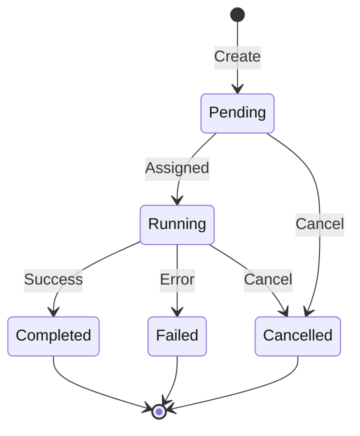

# Task Management

CodeTether provides comprehensive task management for AI agent workflows.

## Task Lifecycle



## Task States

| State | Description |
|-------|-------------|
| `pending` | Task created, waiting for worker |
| `running` | Worker is executing the task |
| `completed` | Task finished successfully |
| `failed` | Task encountered an error |
| `cancelled` | Task was cancelled |

## Creating Tasks

### Via A2A Protocol

```json
{
  "jsonrpc": "2.0",
  "method": "message/send",
  "params": {
    "message": {
      "parts": [{"type": "text", "content": "Analyze this codebase"}]
    }
  },
  "id": "1"
}
```

### Via OpenCode API

```bash
curl -X POST /v1/opencode/codebases/{id}/tasks \
  -d '{"title": "Add tests", "prompt": "Add unit tests"}'
```

## Task Priority

Tasks can be prioritized (higher number = higher priority):

```json
{
  "title": "Urgent fix",
  "prompt": "Fix the authentication bug",
  "priority": 10
}
```

## Task Routing

Tasks are routed to workers based on `codebase_id`:

| Codebase ID | Routing Behavior |
|-------------|------------------|
| `{specific_id}` | Routed only to workers with that codebase registered |
| `global` | Routed to all workers with a global codebase |
| `__pending__` | Registration tasks that any worker can claim |

### Global Tasks

Tasks with `codebase_id: "global"` are sent to all workers that have registered a global codebase. This is useful for:

- Cross-codebase operations
- Administrative tasks
- Tasks that don't belong to a specific project

```bash
# Create a global task via MCP
curl -X POST /v1/opencode/tasks \
  -d '{
    "title": "System maintenance",
    "prompt": "Run system health checks",
    "codebase_id": "global"
  }'
```

## Next Steps

- [API Reference](../api/overview.md)
- [Distributed Workers](../features/distributed-workers.md)
