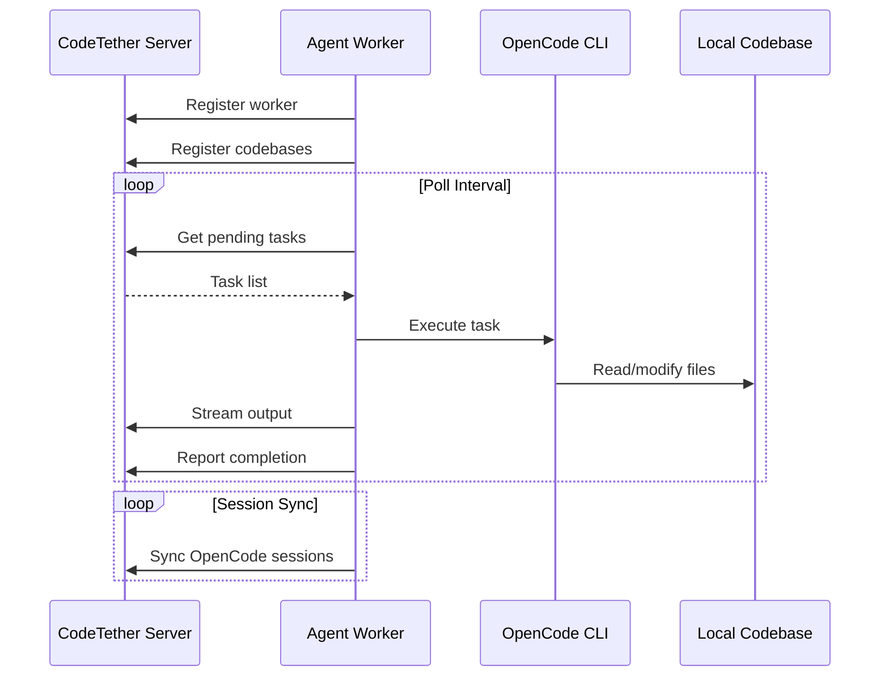

# Agent Worker

The **Agent Worker** is a standalone daemon that runs on machines with codebases, connecting to a CodeTether server to receive and execute AI agent tasks. It enables distributed, autonomous code execution across your infrastructure.

!!! success "Zero-Touch Automation"
    Once configured, the Agent Worker autonomously pulls tasks from the server, executes them using OpenCode, and reports results—all without human intervention.

## Overview

The Agent Worker provides:

- **Remote Task Execution**: Run AI agents on machines where codebases live
- **Codebase Registration**: Automatically register local codebases with the server
- **Session Sync**: Report OpenCode session history to the central server
- **Output Streaming**: Real-time task output streaming to the server
- **Graceful Lifecycle**: Proper shutdown handling and resource cleanup
- **Systemd Integration**: Run as a production-grade Linux service



## Architecture

The Agent Worker acts as a bridge between the CodeTether server and local codebases:

```
┌─────────────────────────────────────────────────────────────┐
│                    Remote Machine                            │
│  ┌─────────────────────────────────────────────────────┐    │
│  │              Agent Worker Daemon                     │    │
│  │  ┌─────────────┐  ┌──────────────┐  ┌────────────┐  │    │
│  │  │   Poller    │  │  Executor    │  │  Reporter  │  │    │
│  │  │  (tasks)    │  │  (opencode)  │  │  (output)  │  │    │
│  │  └──────┬──────┘  └──────┬───────┘  └─────┬──────┘  │    │
│  │         │                │                │         │    │
│  │         └────────────────┼────────────────┘         │    │
│  │                          │                          │    │
│  └──────────────────────────┼──────────────────────────┘    │
│                             │                               │
│  ┌──────────────────────────┼──────────────────────────┐    │
│  │   /home/user/project-a   │   /home/user/project-b   │    │
│  │        Codebase 1        │        Codebase 2        │    │
│  └──────────────────────────┴──────────────────────────┘    │
│                             │                               │
│                             ▼                               │
│                     OpenCode Binary                         │
│                    ~/.local/bin/opencode                    │
└─────────────────────────────────────────────────────────────┘
                              │
                              │ HTTPS
                              ▼
                    ┌─────────────────┐
                    │ CodeTether API  │
                    │ api.codetether  │
                    │      .run       │
                    └─────────────────┘
```

### Components

| Component | Purpose |
|-----------|---------|
| **Poller** | Fetches pending tasks from the server at configurable intervals |
| **Executor** | Runs OpenCode agents on local codebases |
| **Reporter** | Streams task output and syncs session history |
| **Lifecycle Manager** | Handles worker registration, signals, and cleanup |

---

## Installation

### Quick Install (Linux)

```bash
# Clone repository (if not already)
git clone https://github.com/rileyseaburg/codetether.git
cd codetether

# Run installer as root
sudo ./agent_worker/install.sh
```

The installer:

1. Creates a dedicated `a2a-worker` system user
2. Installs the worker script to `/opt/a2a-worker/`
3. Creates a Python virtual environment with dependencies
4. Installs the systemd service unit
5. Creates configuration directory at `/etc/a2a-worker/`

### Manual Installation

```bash
# Create directories
sudo mkdir -p /opt/a2a-worker /etc/a2a-worker

# Copy worker script
sudo cp agent_worker/worker.py /opt/a2a-worker/
sudo chmod +x /opt/a2a-worker/worker.py

# Create virtual environment
sudo python3 -m venv /opt/a2a-worker/venv
sudo /opt/a2a-worker/venv/bin/pip install aiohttp

# Copy configuration
sudo cp agent_worker/config.example.json /etc/a2a-worker/config.json
sudo chmod 600 /etc/a2a-worker/config.json

# Install systemd service
sudo cp agent_worker/systemd/a2a-agent-worker.service /etc/systemd/system/
sudo systemctl daemon-reload
```

### Requirements

- **Python 3.8+** with `asyncio` and `aiohttp`
- **OpenCode** built from the local fork (see [OpenCode Integration](opencode.md))
- **Network access** to the CodeTether server
- **Read/write access** to configured codebases

---

## Configuration

### Configuration File

The worker reads configuration from `/etc/a2a-worker/config.json`:

```json
{
    "server_url": "https://api.codetether.run",
    "worker_name": "dev-vm-worker",
    "poll_interval": 5,
    "opencode_bin": null,
    "codebases": [
        {
            "name": "my-project",
            "path": "/home/user/my-project",
            "description": "Main application repository"
        },
        {
            "name": "backend-api",
            "path": "/home/user/backend-api",
            "description": "Backend microservices"
        }
    ],
    "capabilities": [
        "opencode",
        "build",
        "deploy",
        "test"
    ]
}
```

### Configuration Options

| Option | Type | Default | Description |
|--------|------|---------|-------------|
| `server_url` | string | — | **Required.** CodeTether server URL |
| `worker_name` | string | hostname | Human-readable name for the worker |
| `poll_interval` | integer | `5` | Seconds between task polls |
| `opencode_bin` | string | auto-detect | Path to OpenCode binary |
| `opencode_storage_path` | string | auto-detect | Override OpenCode storage directory (contains `project/`, `session/`, `message/`, `part/`) |
| `codebases` | array | `[]` | List of codebases to register |
| `codebases[].name` | string | directory name | Display name for the codebase |
| `codebases[].path` | string | — | **Required.** Absolute path to codebase |
| `codebases[].description` | string | `""` | Description of the codebase |
| `session_message_sync_max_sessions` | integer | `3` | How many *most recent* sessions (per codebase, including **global**) to also sync messages for (UI detail panel) |
| `session_message_sync_max_messages` | integer | `100` | How many *most recent* messages (per session) to sync |
| `capabilities` | array | `["opencode", "build", "deploy"]` | Worker capabilities to advertise |

### Model Filtering & Authentication

The Agent Worker now automatically filters the models it registers with the server based on available authentication.

- **Authenticated Models Only**: The worker checks for valid credentials in the OpenCode `auth.json` file.
- **Dynamic Registration**: Only models from providers with active authentication (e.g., Anthropic, OpenAI, Google) are reported to the server.
- **Provider Support**: Supports filtering for Anthropic, OpenAI, Google (Gemini), Azure, AWS Bedrock, and more.

This ensures that the UI only presents models that the worker is actually capable of using, preventing "Model not found" or "Authentication failed" errors during task execution.

### Environment Variables

Environment variables can override configuration:

```bash
# /etc/a2a-worker/env
A2A_SERVER_URL=https://api.codetether.run
A2A_WORKER_NAME=production-worker-1
A2A_POLL_INTERVAL=10

# If the worker runs as a service user (e.g. /opt/a2a-worker) but OpenCode sessions
# live under a different user's home, point the worker at that storage:
# A2A_OPENCODE_STORAGE_PATH=/home/riley/.local/share/opencode/storage

# Optional tuning for how much session detail gets synced:
# A2A_SESSION_MESSAGE_SYNC_MAX_SESSIONS=3
# A2A_SESSION_MESSAGE_SYNC_MAX_MESSAGES=100
```

| Variable | Description |
|----------|-------------|
| `A2A_SERVER_URL` | CodeTether server URL |
| `A2A_WORKER_NAME` | Worker identifier |
| `A2A_POLL_INTERVAL` | Poll interval in seconds |
| `A2A_OPENCODE_STORAGE_PATH` | Override OpenCode storage path (useful under systemd service accounts) |
| `A2A_SESSION_MESSAGE_SYNC_MAX_SESSIONS` | Number of recent sessions to sync messages for |
| `A2A_SESSION_MESSAGE_SYNC_MAX_MESSAGES` | Number of recent messages to sync per session |

!!! note "Precedence (what wins)"
    Worker settings follow this precedence order:

    1. **CLI flags** (e.g. `--server`, `--name`, `--poll-interval`)
    2. **Environment variables** (e.g. `A2A_SERVER_URL`)
    3. **Config file** (`/etc/a2a-worker/config.json`)
    4. Built-in defaults

    If you're running under **systemd**, the unit file often sets `A2A_SERVER_URL` directly.
    To override without editing the unit, put overrides in `/etc/a2a-worker/env` (the unit loads it via `EnvironmentFile`).

---

## Running the Worker

### Systemd Service (Recommended)

```bash
# Start the service
sudo systemctl start a2a-agent-worker

# Enable on boot
sudo systemctl enable a2a-agent-worker

# Check status
sudo systemctl status a2a-agent-worker

# View logs
sudo journalctl -u a2a-agent-worker -f
```

### Manual Execution

For debugging or testing:

```bash
# Basic usage
python3 agent_worker/worker.py \
    --server https://api.codetether.run \
    --name my-worker

# With config file
python3 agent_worker/worker.py --config /etc/a2a-worker/config.json

# With inline codebase
python3 agent_worker/worker.py \
    --server https://api.codetether.run \
    --codebase my-project:/home/user/my-project \
    --codebase other-project:/home/user/other-project

# Custom poll interval
python3 agent_worker/worker.py \
    --server https://api.codetether.run \
    --poll-interval 10
```

### Command-Line Options

| Flag | Short | Description |
|------|-------|-------------|
| `--server` | `-s` | Server URL |
| `--name` | `-n` | Worker name |
| `--config` | `-c` | Path to config file |
| `--codebase` | `-b` | Codebase to register (format: `name:path` or just `path`) |
| `--poll-interval` | `-i` | Poll interval in seconds |
| `--opencode` | — | Path to OpenCode binary |
| `--opencode-storage-path` | — | Override OpenCode storage directory |
| `--session-message-sync-max-sessions` | — | Recent sessions per codebase to sync messages for |
| `--session-message-sync-max-messages` | — | Recent messages per session to sync |

---

## How It Works

### 1. Worker Registration

On startup, the worker registers itself with the server:

```http
POST /v1/opencode/workers/register
{
    "worker_id": "abc123",
    "name": "dev-vm-worker",
    "capabilities": ["opencode", "build", "deploy"],
    "hostname": "dev-vm.internal"
}
```

### 2. Codebase Registration

Each configured codebase is registered:

```http
POST /v1/opencode/codebases
{
    "name": "my-project",
    "path": "/home/user/my-project",
    "description": "Main application",
    "worker_id": "abc123"
}
```

!!! info "Worker Affinity"
    Tasks for a codebase are routed only to the worker that registered it. This ensures tasks execute where the code actually lives.

### 3. Task Polling

The worker polls for pending tasks:

```http
GET /v1/opencode/tasks?status=pending&worker_id=abc123
```

Only tasks assigned to this worker's codebases are returned.

### 4. Task Execution

When a task is received:

1. **Claim**: Worker marks task as `running`
2. **Execute**: Runs OpenCode with the task prompt
3. **Stream**: Output is streamed to the server in real-time
4. **Report**: Final status (`completed` or `failed`) is reported

```bash
# Equivalent OpenCode command
opencode run --agent build --format json "Add unit tests for auth module"
```

### 5. Session Sync

Every ~60 seconds, the worker syncs OpenCode session history:

```http
POST /v1/opencode/codebases/{id}/sessions/sync
{
    "worker_id": "abc123",
    "sessions": [
        {
            "id": "sess_xyz",
            "title": "Added unit tests",
            "created": "2025-12-10T15:00:00Z",
            "updated": "2025-12-10T15:05:00Z",
            "messageCount": 12
        }
    ]
}
```

---

## Task Workflow

### Creating a Task

Tasks can be created via the API:

```bash
curl -X POST https://api.codetether.run/v1/opencode/codebases/cb_abc/tasks \
  -H "Content-Type: application/json" \
  -d '{
    "title": "Add authentication",
    "prompt": "Implement JWT authentication for the API endpoints",
    "agent_type": "build",
    "metadata": {
        "model": "anthropic/claude-sonnet-4-20250514"
    }
}'
```

### Task Lifecycle

```
pending → running → completed
              ↓
            failed
```

| Status | Description |
|--------|-------------|
| `pending` | Waiting for a worker to pick up |
| `running` | Currently being executed |
| `completed` | Successfully finished |
| `failed` | Execution error occurred |

### Resuming Sessions

Tasks can resume existing OpenCode sessions:

```json
{
    "title": "Continue refactoring",
    "prompt": "Continue the database refactoring from where we left off",
    "metadata": {
        "resume_session_id": "sess_xyz789"
    }
}
```

---

## Security

### Systemd Hardening

The provided service unit includes security hardening:

```ini
[Service]
# Run as dedicated user
User=a2a-worker
Group=a2a-worker

# Security restrictions
NoNewPrivileges=true
ProtectSystem=full
ProtectHome=read-only
ReadWritePaths=/home /opt/a2a-worker
PrivateTmp=true

# Resource limits
MemoryMax=2G
CPUQuota=200%
```

### File Permissions

```bash
# Configuration is readable only by root/worker
sudo chmod 600 /etc/a2a-worker/config.json
sudo chown a2a-worker:a2a-worker /etc/a2a-worker/config.json
```

### Network Security

- Use HTTPS for all server communication
- Consider VPN or private network for internal deployments
- Use authentication tokens when available

---

## Monitoring

### Logs

```bash
# Live logs
sudo journalctl -u a2a-agent-worker -f

# Recent logs
sudo journalctl -u a2a-agent-worker -n 100

# Since last boot
sudo journalctl -u a2a-agent-worker -b
```

### Health Checks

```bash
# Service status
sudo systemctl status a2a-agent-worker

# Process check
pgrep -f "worker.py" && echo "Running" || echo "Not running"
```

### Server-Side Monitoring

Check worker status from the server:

```bash
curl https://api.codetether.run/v1/monitor/workers
```

```json
{
    "workers": [
        {
            "id": "abc123",
            "name": "dev-vm-worker",
            "status": "active",
            "last_heartbeat": "2025-12-10T15:30:00Z",
            "codebases": 2,
            "tasks_completed": 42
        }
    ]
}
```

---

## Troubleshooting

### UI/API says “No workers available”

This error happens when you try to register a codebase *by path* (from the UI or API) but the server currently has **zero registered workers**.

Fix checklist:

1. **Start the worker on the machine that has the codebase path**

    - `sudo systemctl start a2a-agent-worker`
    - `sudo systemctl status a2a-agent-worker`

2. **Make sure the worker points at the same server URL your UI/API is using**

    - Inspect what systemd is passing:
      - `sudo systemctl cat a2a-agent-worker | grep A2A_SERVER_URL`
    - If needed, override via `/etc/a2a-worker/env`:
      - `A2A_SERVER_URL=https://api.codetether.run`
    - Then restart:
      - `sudo systemctl restart a2a-agent-worker`

3. **Verify the server sees at least one worker**

    - `curl https://api.codetether.run/v1/opencode/workers`

If `/v1/opencode/workers` returns an empty list, the server will reject path-based registration requests.

### Worker is running, but `/v1/opencode/workers` or `/v1/opencode/codebases` is empty

If the worker logs show successful registration (e.g. `Worker registered successfully` / `Registered codebase ...`) but the API still reports **zero** workers/codebases, this is almost always one of these:

1. **You’re behind a load balancer / multiple API replicas without shared state**
2. **The API pod/container restarted and lost in-memory state**
3. **The OpenCode registry database is not persisted (no volume / wrong `OPENCODE_DB_PATH`)**

Fix checklist:

- **Enable Redis-backed OpenCode state on the server** (recommended for Kubernetes and any multi-replica deployment):

    - Set `A2A_REDIS_URL` on the **server** (not the worker), e.g.:
        - `A2A_REDIS_URL=redis://redis:6379`
    - This lets workers/codebases/sessions be visible consistently across API replicas.

- **Persist the OpenCode DB if you rely on SQLite**:

    - Set `OPENCODE_DB_PATH` to a path on a persistent volume (e.g. `/data/opencode.db`).

- **Force a fresh re-registration**:

    - Restart the worker: `sudo systemctl restart a2a-agent-worker`
    - Then re-check:
        - `curl https://api.codetether.run/v1/opencode/workers`
        - `curl https://api.codetether.run/v1/opencode/codebases`

If the lists “flap” (sometimes empty, sometimes populated), it’s a strong signal that your load balancer is routing reads/writes to different replicas without a shared backing store.

### Registration task stuck in “pending”

When you register a codebase from the UI **without** providing a `worker_id`, the server creates a special registration task with:

- `agent_type = "register_codebase"`
- `codebase_id = "__pending__"`

Any worker can claim these tasks, validate the path exists locally, and then confirm registration.

How to debug:

1. Check pending tasks:

    - `curl https://api.codetether.run/v1/opencode/tasks?status=pending`

2. Watch worker logs for the claim:

    - `sudo journalctl -u a2a-agent-worker -f`
    - You should see something like: `Handling registration task ...`

3. Ensure the worker user can read the path:

    - `sudo -u a2a-worker ls -la /path/to/your/codebase`

If the task remains pending and the worker never logs that it handled it, confirm the worker is polling and is connected to the correct server.

### Worker Not Starting

```bash
# Check logs
sudo journalctl -u a2a-agent-worker -n 50

# Common issues:
# - Python environment not created
# - aiohttp not installed
# - Config file missing or invalid
```

### Cannot Connect to Server

```bash
# Test connectivity
curl -I https://api.codetether.run/v1/opencode/status

# Check DNS resolution
nslookup api.codetether.run

# Check firewall
sudo iptables -L -n | grep 443
```

### OpenCode Not Found

```bash
# Check OpenCode location
which opencode
ls -la ~/.local/bin/opencode

# Verify it works
opencode --version

# Set explicit path in config
{
    "opencode_bin": "/home/user/.local/bin/opencode"
}
```

### Codebase Not Registering

```bash
# Verify path exists
ls -la /home/user/my-project

# Check worker user has access
sudo -u a2a-worker ls /home/user/my-project

# Add worker to user's group
sudo usermod -a -G $USER a2a-worker
```

### Tasks Not Executing

```bash
# Check task queue on server
curl https://api.codetether.run/v1/opencode/tasks?status=pending

# Verify codebase is registered with worker_id
curl https://api.codetether.run/v1/opencode/codebases

# Check worker is polling (in logs)
sudo journalctl -u a2a-agent-worker | grep "poll"
```

---

## Advanced Configuration

### Multiple Workers

Run multiple workers for different codebase sets:

```bash
# Worker 1 - Production codebases
python3 worker.py --name prod-worker --config /etc/a2a-worker/prod.json

# Worker 2 - Development codebases
python3 worker.py --name dev-worker --config /etc/a2a-worker/dev.json
```

### Custom Capabilities

Advertise specific capabilities:

```json
{
    "capabilities": [
        "opencode",
        "python",
        "typescript",
        "docker",
        "kubernetes"
    ]
}
```

### OpenCode Model Selection

Tasks can specify which model to use:

```json
{
    "prompt": "Refactor the database module",
    "metadata": {
        "model": "anthropic/claude-sonnet-4-20250514"
    }
}
```

Supported models:

- `anthropic/claude-sonnet-4-20250514`
- `anthropic/claude-opus-4-20250514`
- `openai/gpt-4o`
- `google/gemini-2.0-flash`
- And many more (see [Models API](../api/opencode.md#list-available-models))

---

## File Reference

### worker.py

Location: `/opt/a2a-worker/worker.py` (installed) or `agent_worker/worker.py` (source)

Main worker script containing:

- `WorkerConfig` - Configuration dataclass
- `LocalCodebase` - Registered codebase dataclass
- `AgentWorker` - Main worker class
- Task polling, execution, and reporting logic
- OpenCode session discovery and sync

### config.example.json

Location: `agent_worker/config.example.json`

Example configuration file to copy and customize.

### install.sh

Location: `agent_worker/install.sh`

Installation script that sets up the worker as a systemd service.

### a2a-agent-worker.service

Location: `agent_worker/systemd/a2a-agent-worker.service`

Systemd service unit with security hardening and resource limits.

---

## Next Steps

- [OpenCode Integration](opencode.md) - Learn about OpenCode features
- [Distributed Workers](distributed-workers.md) - Scale workers horizontally
- [OpenCode API](../api/opencode.md) - Full API reference
- [Production Deployment](../deployment/production.md) - Production checklist
