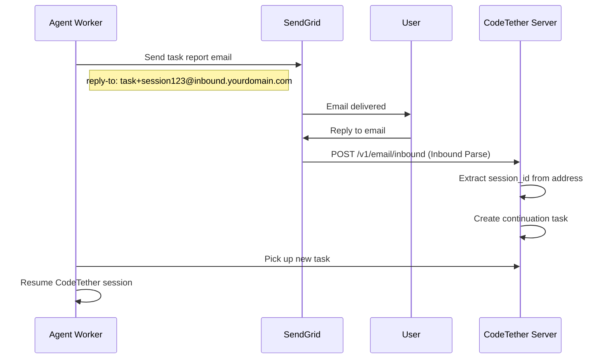

# Agent Worker

The **Agent Worker** is a standalone daemon that runs on machines with codebases, connecting to a CodeTether server to receive and execute AI agent tasks. It enables distributed, autonomous code execution across your infrastructure.

!!! success "Zero-Touch Automation"
    Once configured, the Agent Worker autonomously pulls tasks from the server, executes them using CodeTether, and reports results—all without human intervention.

!!! tip "Reactive Execution"
    Workers now support **real-time task execution** via Redis MessageBroker events. Tasks start within milliseconds of creation instead of waiting for the next poll cycle.

## Overview

The Agent Worker provides:

- **Remote Task Execution**: Run AI agents on machines where codebases live
- **Reactive Task Execution**: Near-instant task start via Redis pub/sub events
- **Agent Discovery**: Workers auto-register as discoverable agents (v1.2.2+)
- **Codebase Registration**: Automatically register local codebases with the server
- **Session Sync**: Report CodeTether session history to the central server
- **Output Streaming**: Real-time task output streaming to the server
- **Graceful Lifecycle**: Proper shutdown handling and resource cleanup
- **Systemd Integration**: Run as a production-grade Linux service

!!! new "v1.2.2: Agent Discovery"
    Workers now automatically register as discoverable agents with role:instance identity pattern. Other agents can find and route tasks to specific workers using `discover_agents` and `send_to_agent`.

```mermaid
sequenceDiagram
    participant Server as CodeTether Server
    participant Redis as Redis (MessageBroker)
    participant Worker as Agent Worker
    participant CodeTether as CodeTether CLI
    participant Codebase as Local Codebase

    Worker->>Server: Register worker
    Worker->>Server: Register codebases
    Worker->>Redis: Subscribe to task events

    par Reactive Path (instant)
    Server->>Redis: Publish task_available event
    Redis->>Worker: Notify via SSE
    Worker->>Worker: GET /v1/worker/tasks/stream with X-Codebases, X-Capabilities headers
    Worker->>CodeTether: Execute task
```

**Headers sent by worker:**

| Header | Description |
|--------|-------------|
| `X-Codebases` | Comma-separated list of registered codebase IDs |
| `X-Capabilities` | Comma-separated list of worker capabilities |
| `worker_id` | Worker identifier |
| `Authorization` | Bearer token if configured |

**Benefits:**
- **Near-instant task start**: Tasks begin within milliseconds of creation
- **Header-based routing**: Server routes tasks based on codebase/capability headers
- **Reduced latency**: No waiting for poll interval
- **Battery efficient**: No periodic polling overhead

**Configuration:**
```json
{
    "redis_url": "redis://localhost:6379"
}
```

Or via environment:
```bash
A2A_REDIS_URL=redis://localhost:6379
```

The worker automatically detects the server's Redis URL if configured. If Redis is unavailable, the worker seamlessly falls back to polling.

!!! tip "How It Works"
    When a task is created, the server publishes a `task_available` event to Redis and broadcasts via SSE. Workers subscribed to events for their registered codebases (matching `X-Codebases` header) receive the event immediately, fetch the full task details, and start execution.

### 4. Task Polling

The worker polls for pending tasks:

```http
GET /v1/agent/tasks?status=pending&worker_id=abc123
```

Only tasks assigned to this worker's codebases are returned.

### 5. Task Execution

When a task is received:

1. **Claim**: Worker marks task as `running`
2. **Execute**: Runs CodeTether with the task prompt
3. **Stream**: Output is streamed to the server in real-time
4. **Report**: Final status (`completed` or `failed`) is reported

```bash
# Equivalent CodeTether command
agent run --agent build --format json "Add unit tests for auth module"
```

### 6. Session Sync

Every ~60 seconds, the worker syncs CodeTether session history:

```http
POST /v1/agent/codebases/{id}/sessions/sync
{
    "worker_id": "abc123",
    "sessions": [
        {
            "id": "sess_xyz",
            "title": "Added unit tests",
            "created": "2025-12-10T15:00:00Z",
            "updated": "2025-12-10T15:05:00Z",
            "messageCount": 12
        }
    ]
}
```

---

## Task Workflow

### Creating a Task

Tasks can be created via the API:

```bash
curl -X POST https://api.codetether.run/v1/agent/codebases/cb_abc/tasks \
  -H "Content-Type: application/json" \
  -d '{
    "title": "Add authentication",
    "prompt": "Implement JWT authentication for the API endpoints",
    "agent_type": "build",
    "metadata": {
        "model": "anthropic/claude-sonnet-4-20250514"
    }
}'
```

### Task Lifecycle

```
pending → running → completed
              ↓
            failed
```

| Status | Description |
|--------|-------------|
| `pending` | Waiting for a worker to pick up |
| `running` | Currently being executed |
| `completed` | Successfully finished |
| `failed` | Execution error occurred |

### Resuming Sessions

Tasks can resume existing CodeTether sessions:

```json
{
    "title": "Continue refactoring",
    "prompt": "Continue the database refactoring from where we left off",
    "metadata": {
        "resume_session_id": "sess_xyz789"
    }
}
```

---

## Security

### Systemd Hardening

The provided service unit includes security hardening:

```ini
[Service]
# Run as dedicated user
User=a2a-worker
Group=a2a-worker

# Security restrictions
NoNewPrivileges=true
ProtectSystem=full
ProtectHome=read-only
ReadWritePaths=/home /opt/a2a-worker
PrivateTmp=true

# Resource limits
MemoryMax=2G
CPUQuota=200%
```

### File Permissions

```bash
# Configuration is readable only by root/worker
sudo chmod 600 /etc/a2a-worker/config.json
sudo chown a2a-worker:a2a-worker /etc/a2a-worker/config.json
```

### Network Security

- Use HTTPS for all server communication
- Consider VPN or private network for internal deployments
- Use authentication tokens when available

---

## Monitoring

### Logs

```bash
# Live logs
sudo journalctl -u a2a-agent-worker -f

# Recent logs
sudo journalctl -u a2a-agent-worker -n 100

# Since last boot
sudo journalctl -u a2a-agent-worker -b
```

### Health Checks

```bash
# Service status
sudo systemctl status a2a-agent-worker

# Process check
pgrep -f "worker.py" && echo "Running" || echo "Not running"
```

### Server-Side Monitoring

Check worker status from the server:

```bash
curl https://api.codetether.run/v1/monitor/workers
```

```json
{
    "workers": [
        {
            "id": "abc123",
            "name": "dev-vm-worker",
            "status": "active",
            "last_heartbeat": "2025-12-10T15:30:00Z",
            "codebases": 2,
            "tasks_completed": 42
        }
    ]
}
```

---

## Troubleshooting

### UI/API says “No workers available”

This error happens when you try to register a codebase *by path* (from the UI or API) but the server currently has **zero registered workers**.

Fix checklist:

1. **Start the worker on the machine that has the codebase path**

    - `sudo systemctl start a2a-agent-worker`
    - `sudo systemctl status a2a-agent-worker`

2. **Make sure the worker points at the same server URL your UI/API is using**

    - Inspect what systemd is passing:
      - `sudo systemctl cat a2a-agent-worker | grep A2A_SERVER_URL`
    - If needed, override via `/etc/a2a-worker/env`:
      - `A2A_SERVER_URL=https://api.codetether.run`
    - Then restart:
      - `sudo systemctl restart a2a-agent-worker`

3. **Verify the server sees at least one worker**

    - `curl https://api.codetether.run/v1/agent/workers`

If `/v1/agent/workers` returns an empty list, the server will reject path-based registration requests.

### Worker is running, but `/v1/agent/workers` or `/v1/agent/codebases` is empty

If the worker logs show successful registration (e.g. `Worker registered successfully` / `Registered codebase ...`) but the API still reports **zero** workers/codebases, this is almost always one of these:

1. **You’re behind a load balancer / multiple API replicas without shared state**
2. **The API pod/container restarted and lost in-memory state**
3. **The CodeTether registry database is not persisted (no volume / wrong `OPENCODE_DB_PATH`)**

Fix checklist:

- **Enable Redis-backed CodeTether state on the server** (recommended for Kubernetes and any multi-replica deployment):

    - Set `A2A_REDIS_URL` on the **server** (not the worker), e.g.:
        - `A2A_REDIS_URL=redis://redis:6379`
    - This lets workers/codebases/sessions be visible consistently across API replicas.

- **Persist the CodeTether DB if you rely on SQLite**:

    - Set `OPENCODE_DB_PATH` to a path on a persistent volume (e.g. `/data/agent.db`).

- **Force a fresh re-registration**:

    - Restart the worker: `sudo systemctl restart a2a-agent-worker`
    - Then re-check:
        - `curl https://api.codetether.run/v1/agent/workers`
        - `curl https://api.codetether.run/v1/agent/codebases`

If the lists “flap” (sometimes empty, sometimes populated), it’s a strong signal that your load balancer is routing reads/writes to different replicas without a shared backing store.

### Registration task stuck in “pending”

When you register a codebase from the UI **without** providing a `worker_id`, the server creates a special registration task with:

- `agent_type = "register_codebase"`
- `codebase_id = "__pending__"`

Any worker can claim these tasks, validate the path exists locally, and then confirm registration.

How to debug:

1. Check pending tasks:

    - `curl https://api.codetether.run/v1/agent/tasks?status=pending`

2. Watch worker logs for the claim:

    - `sudo journalctl -u a2a-agent-worker -f`
    - You should see something like: `Handling registration task ...`

3. Ensure the worker user can read the path:

    - `sudo -u a2a-worker ls -la /path/to/your/codebase`

If the task remains pending and the worker never logs that it handled it, confirm the worker is polling and is connected to the correct server.

### Worker Not Starting

```bash
# Check logs
sudo journalctl -u a2a-agent-worker -n 50

# Common issues:
# - Python environment not created
# - aiohttp not installed
# - Config file missing or invalid
```

### Cannot Connect to Server

```bash
# Test connectivity
curl -I https://api.codetether.run/v1/agent/status

# Check DNS resolution
nslookup api.codetether.run

# Check firewall
sudo iptables -L -n | grep 443
```

### CodeTether Not Found

```bash
# Check CodeTether location
which agent
ls -la ~/.local/bin/agent

# Verify it works
agent --version

# Set explicit path in config
{
    "agent_bin": "/home/user/.local/bin/agent"
}
```

### Codebase Not Registering

```bash
# Verify path exists
ls -la /home/user/my-project

# Check worker user has access
sudo -u a2a-worker ls /home/user/my-project

# Add worker to user's group
sudo usermod -a -G $USER a2a-worker
```

### Tasks Not Executing

```bash
# Check task queue on server
curl https://api.codetether.run/v1/agent/tasks?status=pending

# Verify codebase is registered with worker_id
curl https://api.codetether.run/v1/agent/codebases

# Check worker is polling (in logs)
sudo journalctl -u a2a-agent-worker | grep "poll"
```

---

## Email Notifications

The Agent Worker can send email notifications when tasks complete or fail. More importantly, users can **reply directly to these emails** to continue the conversation with the worker.

### Configuration

Add SendGrid credentials to your worker config:

```json
{
    "sendgrid_api_key": "SG.xxxxx",
    "sendgrid_from_email": "worker@yourdomain.com",
    "notification_email": "team@yourdomain.com",
    "email_inbound_domain": "inbound.yourdomain.com",
    "email_reply_prefix": "task"
}
```

Or via environment variables:

```bash
SENDGRID_API_KEY=SG.xxxxx
SENDGRID_FROM_EMAIL=worker@yourdomain.com
NOTIFICATION_EMAIL=team@yourdomain.com
EMAIL_INBOUND_DOMAIN=inbound.yourdomain.com
EMAIL_REPLY_PREFIX=task
```

### Email Reply Flow

When `email_inbound_domain` is configured, notification emails include a special reply-to address:

```
task+{session_id}@inbound.yourdomain.com
```

**Flow:**



### Setting Up SendGrid Inbound Parse

1. **Configure your domain's MX records:**

    Point your inbound subdomain to SendGrid:
    ```
    inbound.yourdomain.com. MX 10 mx.sendgrid.net.
    ```

2. **Set up Inbound Parse in SendGrid:**

    - Go to **Settings > Inbound Parse**
    - Click **Add Host & URL**
    - Enter your subdomain: `inbound.yourdomain.com`
    - Set destination URL: `https://api.codetether.run/v1/email/inbound`
    - Check "POST the raw, full MIME message" (optional)
    - Save

3. **Test the setup:**

    Send a test email to `test@inbound.yourdomain.com` and check your server logs.

### Email Content

Notification emails include:

- Task status (completed/failed)
- Task ID and title
- Session ID (for reply threading)
- Worker name
- Duration
- Output (truncated) or error message
- **Reply instructions** (when inbound is configured)

### Troubleshooting

**Emails not sending:**
```bash
# Check worker logs
sudo journalctl -u a2a-agent-worker | grep -i email
```

**Replies not creating tasks:**
```bash
# Check server logs for inbound webhook
curl https://api.codetether.run/v1/email/test-inbound
```

**Test reply-to address parsing:**
```bash
curl "https://api.codetether.run/v1/email/test-reply-address?session_id=test123"
```

---

## Advanced Configuration

### Multiple Workers

Run multiple workers for different codebase sets:

```bash
# Worker 1 - Production codebases
python3 worker.py --name prod-worker --config /etc/a2a-worker/prod.json

# Worker 2 - Development codebases
python3 worker.py --name dev-worker --config /etc/a2a-worker/dev.json
```

### Agent Discovery Registration

Workers automatically register as discoverable agents on startup. Configure the agent identity:

```bash
python3 worker.py \
  --agent-name code-reviewer \
  --agent-description "Python code review specialist" \
  --server https://api.codetether.run
```

Or via config:

```json
{
    "agent_name": "code-reviewer",
    "agent_description": "Python code review specialist",
    "register_as_agent": true
}
```

**Role:Instance Pattern:**

| Field | Purpose | Example |
|-------|---------|---------|
| `name` | Unique discovery identity | `code-reviewer:dev-vm:abc123` |
| `role` | Routing identity for `send_to_agent` | `code-reviewer` |

**Important**: Use `role` with `send_to_agent` for routing. The `name` field is unique per-instance.

**Environment Variables:**

| Variable | Description |
|----------|-------------|
| `A2A_AGENT_NAME` | Agent routing role |
| `A2A_AGENT_DESCRIPTION` | Agent description |
| `A2A_AGENT_URL` | Direct URL (optional) |

**Disable registration** if you don't want the worker to be discoverable:

```bash
python3 worker.py --no-agent-registration
```

### Custom Capabilities

Advertise specific capabilities:

```json
{
    "capabilities": [
        "agent",
        "python",
        "typescript",
        "docker",
        "kubernetes"
    ]
}
```

### CodeTether Model Selection

Tasks can specify which model to use:

```json
{
    "prompt": "Refactor the database module",
    "metadata": {
        "model": "anthropic/claude-sonnet-4-20250514"
    }
}
```

Supported models:

- `anthropic/claude-sonnet-4-20250514`
- `anthropic/claude-opus-4-20250514`
- `openai/gpt-4o`
- `google/gemini-2.0-flash`
- And many more (see [Models API](../api/agent.md#list-available-models))

---

## File Reference

### worker.py

Location: `/opt/a2a-worker/worker.py` (installed) or `agent_worker/worker.py` (source)

Main worker script containing:

- `WorkerConfig` - Configuration dataclass
- `LocalCodebase` - Registered codebase dataclass
- `AgentWorker` - Main worker class
- Task polling, execution, and reporting logic
- CodeTether session discovery and sync

### config.example.json

Location: `agent_worker/config.example.json`

Example configuration file to copy and customize.

### install.sh

Location: `agent_worker/install.sh`

Installation script that sets up the worker as a systemd service.

### a2a-agent-worker.service

Location: `agent_worker/systemd/a2a-agent-worker.service`

Systemd service unit with security hardening and resource limits.

---

## Next Steps

- [CodeTether Integration](agent.md) - Learn about CodeTether features
- [Distributed Workers](distributed-workers.md) - Scale workers horizontally
- [CodeTether API](../api/agent.md) - Full API reference
- [Production Deployment](../deployment/production.md) - Production checklist
