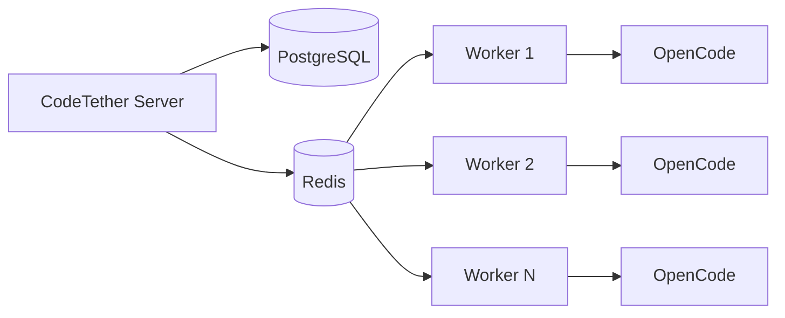

# Distributed Workers

CodeTether supports distributed workers, allowing you to scale AI agent execution across multiple machines.

## Overview

Workers are separate processes that:

- Connect to the CodeTether server
- Poll for assigned tasks
- Execute tasks using the local OpenCode fork (from `opencode/` directory)
- Report results back to the server
- Sync session history to the central server

!!! tip "Agent Worker Documentation"
    For complete installation and configuration details, see the [Agent Worker](agent-worker.md) guide.

## Quick Start

### 1. Install Worker

```bash
# Clone repository
git clone https://github.com/rileyseaburg/codetether.git
cd codetether

# Run installer as root
sudo ./agent_worker/install.sh
```

### 2. Configure Worker

Edit `/etc/a2a-worker/config.json`:

```json
{
  "server_url": "https://api.codetether.run",
  "worker_name": "worker-1",
  "poll_interval": 5,
  "codebases": [
    {
      "name": "my-project",
      "path": "/home/user/my-project",
      "description": "Main application"
    }
  ],
  "capabilities": ["opencode", "build", "deploy", "test"]
}
```

### 3. Start Worker

```bash
sudo systemctl start a2a-agent-worker
sudo systemctl enable a2a-agent-worker
```

### 4. Verify the Worker is Registered

Once started, the server should show at least one registered worker:

```bash
curl https://api.codetether.run/v1/opencode/workers
```

On the worker machine, you can also confirm it is polling:

```bash
sudo systemctl status a2a-agent-worker
sudo journalctl -u a2a-agent-worker -n 100 --no-pager
```

!!! tip "If you see “No workers available”"
  That message is returned when the server has **no registered workers** at the moment a codebase registration-by-path request is made.

  Make sure the worker service is running on the machine that can access the path, and that `A2A_SERVER_URL` points at the same server your UI/API is using.

## Worker Architecture



!!! tip "Durable Persistence with PostgreSQL"
    When `DATABASE_URL` is configured, workers, codebases, and sessions persist across server restarts and work correctly with multiple replicas. Without PostgreSQL, data is stored in Redis (shared) or in-memory (single instance only).

## Configuration Options

| Option | Default | Description |
|--------|---------|-------------|
| `server_url` | — | CodeTether server URL (required) |
| `worker_name` | hostname | Unique worker identifier |
| `poll_interval` | 5 | Seconds between task polls |
| `codebases` | [] | Array of codebase objects to register |
| `opencode_bin` | auto-detect | Path to OpenCode binary |
| `capabilities` | ["opencode", "build", "deploy"] | Advertised capabilities |

## Environment Variables

```bash
export A2A_SERVER_URL=https://api.codetether.run
export A2A_WORKER_NAME=worker-1
export A2A_POLL_INTERVAL=5
```

## Systemd Service

The installer creates `/etc/systemd/system/a2a-agent-worker.service`:

```ini
[Unit]
Description=A2A Agent Worker - OpenCode task executor
After=network-online.target

[Service]
Type=simple
User=a2a-worker
ExecStart=/opt/a2a-worker/venv/bin/python /opt/a2a-worker/worker.py --config /etc/a2a-worker/config.json
Restart=always
RestartSec=10

# Security hardening
NoNewPrivileges=true
ProtectSystem=full
ProtectHome=read-only
ReadWritePaths=/home /opt/a2a-worker

[Install]
WantedBy=multi-user.target
```

Manage the service:

```bash
sudo systemctl start a2a-agent-worker
sudo systemctl stop a2a-agent-worker
sudo systemctl status a2a-agent-worker
sudo journalctl -u a2a-agent-worker -f
```

## Codebase Registration

Register codebases with worker affinity:

```bash
curl -X POST https://api.codetether.run/v1/opencode/codebases \
  -H "Content-Type: application/json" \
  -d '{
    "name": "my-project",
    "path": "/home/user/my-project",
    "description": "Main application",
    "worker_id": "worker-1"
  }'
```

Tasks for this codebase will only be assigned to `worker-1`.

!!! info "Worker Affinity"
    When a codebase is registered with a `worker_id`, only that worker will receive tasks for it. This ensures tasks execute where the code actually lives.

## Scaling

### Horizontal Scaling

Add more workers to handle more concurrent tasks:

```bash
# Worker 1 - Production
python3 worker.py --name prod-worker-1 --config /etc/a2a-worker/prod.json

# Worker 2 - Production
python3 worker.py --name prod-worker-2 --config /etc/a2a-worker/prod.json

# Worker 3 - Development
python3 worker.py --name dev-worker --config /etc/a2a-worker/dev.json
```

### Command Line Usage

```bash
# Basic usage
python3 agent_worker/worker.py \
    --server https://api.codetether.run \
    --name my-worker

# With inline codebases
python3 agent_worker/worker.py \
    --server https://api.codetether.run \
    --codebase my-project:/home/user/my-project \
    --codebase api:/home/user/api
```

### Kubernetes Deployment

```yaml
apiVersion: apps/v1
kind: StatefulSet
metadata:
  name: codetether-worker
spec:
  replicas: 3
  selector:
    matchLabels:
      app: codetether-worker
  template:
    spec:
      containers:
      - name: worker
        image: registry.quantum-forge.net/library/a2a-worker:latest
        env:
        - name: A2A_SERVER_URL
          value: "http://a2a-server:8000"
        - name: A2A_WORKER_NAME
          valueFrom:
            fieldRef:
              fieldPath: metadata.name
        volumeMounts:
        - name: codebases
          mountPath: /codebases
      volumes:
      - name: codebases
        persistentVolumeClaim:
          claimName: codebases-pvc
```

## Monitoring

Check worker status:

```bash
curl https://api.codetether.run/v1/monitor/workers
```

```json
{
  "workers": [
    {
      "id": "worker-1",
      "name": "dev-vm-worker",
      "status": "active",
      "last_heartbeat": "2025-12-10T15:30:00Z",
      "codebases": 3,
      "tasks_completed": 42
    }
  ]
}
```

### Logs

```bash
# View worker logs
sudo journalctl -u a2a-agent-worker -f

# Recent logs
sudo journalctl -u a2a-agent-worker -n 100
```

## Session Sync

Workers automatically sync OpenCode session history to the server every ~60 seconds. This enables:

- Centralized session visibility
- Session resumption from the web UI
- Historical task tracking

The sync includes:

- Session metadata (title, timestamps)
- Message summaries
- Tool usage statistics

## Next Steps

- [Agent Worker](agent-worker.md) - Complete installation and configuration guide
- [Architecture](../concepts/architecture.md) - System architecture overview
- [Kubernetes Deployment](../deployment/kubernetes.md) - Production k8s deployment
- [OpenCode API](../api/opencode.md) - Full API reference
