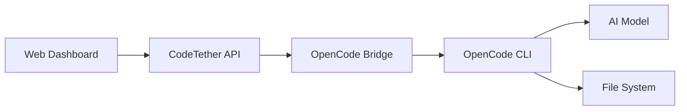

# OpenCode Integration

CodeTether Server integrates with [OpenCode](https://opencode.ai), enabling AI coding agents to work on your codebase with full session management, task queuing, and real-time streaming.

## Overview

The OpenCode Bridge connects CodeTether to the OpenCode CLI, allowing you to:

- **Register codebases** for agents to work on
- **Trigger AI agents** with natural language prompts
- **Stream real-time output** as agents work
- **Manage sessions** with history and resumption
- **Queue tasks** for distributed workers



## Prerequisites

1. **OpenCode installed** on the machine running CodeTether or workers

    ```bash
    # Install OpenCode
    curl -fsSL https://opencode.ai/install.sh | bash

    # Verify installation
    opencode --version
    ```

2. **AI API keys configured** in OpenCode

    ```bash
    # Configure your preferred model provider
    export ANTHROPIC_API_KEY=sk-ant-...
    # or
    export OPENAI_API_KEY=sk-...
    ```

## Quick Start

### 1. Start CodeTether with OpenCode

```bash
codetether serve --port 8000
```

Check that OpenCode is detected:

```bash
curl http://localhost:8000/v1/opencode/status
```

```json
{
  "available": true,
  "opencode_binary": "/usr/local/bin/opencode",
  "registered_codebases": 0
}
```

### 2. Register a Codebase

```bash
curl -X POST http://localhost:8000/v1/opencode/codebases \
  -H "Content-Type: application/json" \
  -d '{
    "name": "my-project",
    "path": "/home/user/projects/my-project",
    "description": "My awesome project"
  }'
```

### 3. Trigger an Agent

```bash
curl -X POST http://localhost:8000/v1/opencode/codebases/{id}/trigger \
  -H "Content-Type: application/json" \
  -d '{
    "prompt": "Add comprehensive error handling to the API routes",
    "agent": "build",
    "model": "anthropic/claude-sonnet-4-20250514"
  }'
```

### 4. Watch Real-time Output

```bash
curl -N http://localhost:8000/v1/opencode/codebases/{id}/events
```

## Agent Types

| Agent | Description | Use Case |
|-------|-------------|----------|
| `build` | Implementation agent | Writing code, fixing bugs, adding features |
| `plan` | Planning agent | Architecture, design, breaking down tasks |
| `explore` | Exploration agent | Understanding codebase, answering questions |
| `general` | General purpose | Flexible, multi-purpose tasks |

## Available Models

CodeTether supports multiple AI model providers:

```bash
curl http://localhost:8000/v1/opencode/models
```

**Anthropic**
- `anthropic/claude-opus-4` - Most capable
- `anthropic/claude-sonnet-4-20250514` - Best balance (recommended)
- `anthropic/claude-3-5-haiku-20241022` - Fast and affordable

**OpenAI**
- `openai/gpt-4o` - GPT-4 Omni
- `openai/o1` - Reasoning model
- `openai/o3-mini` - Latest mini model

**Google**
- `google/gemini-2.0-flash` - Fast
- `google/gemini-2.5-pro` - Most capable

**Others**
- `deepseek/deepseek-chat` - DeepSeek
- `xai/grok-2` - xAI Grok

## Session Management

### View Sessions

```bash
curl http://localhost:8000/v1/opencode/codebases/{id}/sessions
```

### Resume a Session

Sessions are automatically resumed when you trigger an agent on a codebase that has an active session.

### Sync Sessions from OpenCode

If you've used OpenCode directly (outside CodeTether), sync the sessions:

```bash
curl -X POST http://localhost:8000/v1/opencode/codebases/{id}/sessions/sync
```

## Task Queue

For distributed setups, create tasks that workers pick up:

### Create a Task

```bash
curl -X POST http://localhost:8000/v1/opencode/codebases/{id}/tasks \
  -H "Content-Type: application/json" \
  -d '{
    "title": "Add unit tests",
    "prompt": "Add unit tests for the authentication module",
    "agent_type": "build",
    "priority": 1
  }'
```

### List Pending Tasks

```bash
curl http://localhost:8000/v1/opencode/tasks?status=pending
```

## Real-time Streaming

Subscribe to agent events via SSE:

```javascript
const events = new EventSource('/v1/opencode/codebases/{id}/events');

events.addEventListener('output', (e) => {
  const data = JSON.parse(e.data);
  process.stdout.write(data.content);
});

events.addEventListener('tool_use', (e) => {
  const data = JSON.parse(e.data);
  console.log(`\n🔧 Using tool: ${data.tool}`);
});

events.addEventListener('file_change', (e) => {
  const data = JSON.parse(e.data);
  console.log(`\n📁 ${data.action}: ${data.path}`);
});

events.addEventListener('complete', () => {
  console.log('\n✅ Agent completed!');
  events.close();
});
```

## Configuration

### Environment Variables

| Variable | Default | Description |
|----------|---------|-------------|
| `OPENCODE_HOST` | `localhost` | Host where OpenCode API is running |
| `OPENCODE_PORT` | `9777` | OpenCode API port |
| `OPENCODE_DB_PATH` | `./data/opencode.db` | SQLite database for sessions |
| `OPENCODE_AUTO_START` | `true` | Auto-start agents on trigger |

!!! tip \"Docker Container Configuration\"\n    When running CodeTether in Docker and connecting to OpenCode on your host:\n    \n    ```bash\n    # Docker Desktop (Mac/Windows)\n    docker run -e OPENCODE_HOST=host.docker.internal ...\n    \n    # Linux\n    docker run --add-host=host.docker.internal:host-gateway \\\n      -e OPENCODE_HOST=host.docker.internal ...\n    ```

### Codebase Configuration

Each codebase can have custom agent config:

```json
{
  "name": "my-project",
  "path": "/path/to/project",
  "agent_config": {
    "default_model": "anthropic/claude-sonnet-4-20250514",
    "auto_approve": false,
    "max_iterations": 50,
    "working_directory": "/path/to/project"
  }
}
```

## Distributed Workers

For scaling, run OpenCode agents on dedicated worker machines:

### On Worker Machine

```bash
# Install CodeTether (includes the worker CLI)
pip install codetether

# Run the worker (manual mode)
# Note: you can pass --codebase multiple times. Format: name:path (or just a path).
codetether-worker \
  --server https://codetether.example.com \
  --name worker-1 \
  --codebase app1:/projects/app1 \
  --codebase app2:/projects/app2
```

### Register Worker Codebases

```bash
curl -X POST https://codetether.example.com/v1/opencode/codebases \
  -H "Content-Type: application/json" \
  -d '{
    "name": "app1",
    "path": "/projects/app1",
    "worker_id": "worker-1"
  }'
```

Tasks for `app1` will be routed to `worker-1`.

## Troubleshooting

### OpenCode Not Available

```json
{"available": false, "message": "OpenCode bridge not available"}
```

**Solutions:**
1. Ensure OpenCode is installed: `which opencode`
2. Check PATH includes OpenCode: `export PATH=$PATH:/usr/local/bin`
3. Verify OpenCode works: `opencode --version`

### No Models Returned

The `/v1/opencode/models` endpoint returns a static list. If empty:
1. Check server logs for errors
2. Verify the server started correctly

### Session Not Found

```json
{"detail": "Session not found"}
```

**Solutions:**
1. Sync sessions: `POST /v1/opencode/codebases/{id}/sessions/sync`
2. Check the OpenCode database exists at `OPENCODE_DB_PATH`

## API Reference

See the full [OpenCode API Reference](../api/opencode.md) for all endpoints.
