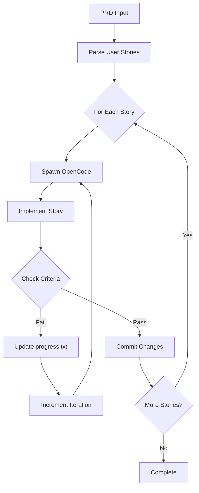

# Ralph: Autonomous Development Loop

Ralph is CodeTether's fully autonomous development agent that implements entire PRDs (Product Requirements Documents) with zero human intervention. Define your user stories, and Ralph writes the code, runs tests, and commits—iterating until all acceptance criteria pass.

!!! success "Zero-Touch Development"
    Ralph autonomously implements features, handles failures through iterative learning, and produces production-ready code with atomic commits per user story.

## Overview

Ralph provides:

- **PRD-Driven Development**: Define user stories with acceptance criteria
- **Fresh Context Per Story**: Each story spawns a new OpenCode instance
- **Iterative Learning**: Failed stories trigger re-analysis with accumulated context
- **Self-Healing**: Automatic retry with learnings when acceptance criteria fail
- **Git Integration**: Atomic commits per user story with meaningful messages
- **RLM Support**: Handles large codebases via Recursive Language Models

## How Ralph Works



### The Ralph Loop

1. **PRD Parsing**: Ralph reads your PRD (YAML format) and extracts user stories
2. **Story Iteration**: For each user story:
   - Spawns a fresh OpenCode instance (clean context)
   - Loads the story requirements and acceptance criteria
   - Implements the feature
   - Runs acceptance criteria checks
3. **Self-Healing**: If criteria fail:
   - Updates `progress.txt` with learnings
   - Increments iteration counter
   - Retries with accumulated context
4. **Commit**: On success, creates atomic commit for the story
5. **Next Story**: Moves to the next user story

---

## PRD Format

Ralph uses YAML-formatted PRDs:

```yaml
project: MyApp
branchName: ralph/add-user-auth
description: Implement user authentication system
userStories:
  - id: US-001
    title: Add user model to database
    description: As a developer, I need a User model with email and password
    acceptanceCriteria:
      - User model exists with email and hashed_password fields
      - Migration file creates users table
      - Model has password hashing method

  - id: US-002
    title: Create login endpoint
    description: As a user, I can login with email and password
    acceptanceCriteria:
      - POST /api/auth/login accepts email and password
      - Returns JWT token on success
      - Returns 401 on invalid credentials

  - id: US-003
    title: Add authentication middleware
    description: As a developer, I can protect routes with auth middleware
    acceptanceCriteria:
      - Middleware validates JWT tokens
      - Protected routes return 401 without valid token
      - User context available in request
```

### PRD Fields

| Field | Required | Description |
|-------|----------|-------------|
| `project` | Yes | Project name |
| `branchName` | Yes | Git branch for changes |
| `description` | Yes | Overall feature description |
| `userStories` | Yes | Array of user stories |

### User Story Fields

| Field | Required | Description |
|-------|----------|-------------|
| `id` | Yes | Unique identifier (e.g., US-001) |
| `title` | Yes | Short title |
| `description` | Yes | User story description |
| `acceptanceCriteria` | Yes | List of criteria that must pass |

---

## Dashboard

Access Ralph at `/dashboard/ralph`:

### PRD Builder

- **Visual Editor**: Create PRDs interactively
- **YAML Import/Export**: Import existing PRDs or export for version control
- **Syntax Validation**: Real-time validation of PRD format
- **Templates**: Start from common patterns

### Execution Monitor

- **Live Logs**: Real-time output from Ralph's execution
- **Story Status**: Visual indicators for pending/running/passed/failed
- **Iteration Count**: Track retry attempts per story
- **Context Usage**: Monitor token usage per story

### Agent Overview

- **Active Agents**: See which OpenCode instances are running
- **Task Queue**: View pending stories
- **Progress Metrics**: Pass rate, average iterations, time per story

---

## RLM Integration

Ralph leverages RLM (Recursive Language Models) for large codebase analysis:

### When RLM Activates

- Context exceeds configurable threshold (default: 80K tokens)
- Analyzing complex multi-file changes
- Understanding large dependency graphs

### Benefits

- **No Context Limits**: Process arbitrarily large codebases
- **Preserved Progress**: Context from `progress.txt` carries across iterations
- **Intelligent Chunking**: Automatically breaks down complex analysis

### Configuration

```bash
# Enable RLM for Ralph
export OPENCODE_RLM_ENABLED=1

# Model for subcalls
export A2A_RLM_DEFAULT_SUBCALL_MODEL_REF="zai:glm-4.7"

# Guardrails
export A2A_RLM_MAX_SUBCALLS_PER_ITERATION=5
export A2A_RLM_MAX_TOTAL_SUBCALLS=100
```

---

## Configuration

### Environment Variables

| Variable | Default | Description |
|----------|---------|-------------|
| `RALPH_ENABLED` | `1` | Enable Ralph in dashboard |
| `RALPH_MAX_ITERATIONS` | `5` | Max retries per story |
| `RALPH_COMMIT_ON_PASS` | `1` | Auto-commit on success |
| `RALPH_BRANCH_PREFIX` | `ralph/` | Branch name prefix |

### Dashboard Settings

Configure in `/dashboard/ralph`:

- **Model Selection**: Choose which LLM powers Ralph
- **Auto-commit**: Toggle automatic commits
- **Branch Strategy**: Configure branch naming
- **Notification Settings**: Email on completion/failure

---

## Best Practices

### Writing Effective PRDs

1. **Specific Acceptance Criteria**: Be precise about what "done" looks like
2. **Testable Conditions**: Criteria should be verifiable by Ralph
3. **Incremental Stories**: Build complexity gradually
4. **Clear Dependencies**: Order stories logically

### Good Example

```yaml
userStories:
  - id: US-001
    title: Add email validation
    acceptanceCriteria:
      - Function validates email format using regex
      - Returns true for valid emails like user@example.com
      - Returns false for invalid emails like "not-an-email"
      - Unit test exists and passes
```

### Poor Example

```yaml
userStories:
  - id: US-001
    title: Make it work
    acceptanceCriteria:
      - Feature is complete
      - No bugs
```

---

## Troubleshooting

### Story Keeps Failing

1. **Check criteria specificity**: Are criteria testable?
2. **Review progress.txt**: What is Ralph learning?
3. **Lower max iterations**: Fail fast to diagnose issues

### Context Overflow

1. **Enable RLM**: Set `OPENCODE_RLM_ENABLED=1`
2. **Split large stories**: Break into smaller units
3. **Increase threshold**: Adjust RLM trigger threshold

### Git Conflicts

1. **Clean working directory**: Ensure no uncommitted changes
2. **Fresh branch**: Use unique branch names
3. **Review commits**: Check Ralph's commit messages

---

## API Reference

### Start Ralph Run

```http
POST /v1/ralph/runs
Content-Type: application/json

{
  "codebase_id": "cb_abc123",
  "prd": "...(YAML string)...",
  "config": {
    "max_iterations": 5,
    "auto_commit": true
  }
}
```

### Get Run Status

```http
GET /v1/ralph/runs/{run_id}
```

### List Runs

```http
GET /v1/ralph/runs?codebase_id=cb_abc123
```

### Cancel Run

```http
POST /v1/ralph/runs/{run_id}/cancel
```

---

## Next Steps

- [OpenCode Integration](opencode.md) - Learn about OpenCode features
- [RLM Guide](../opencode-integration.md#rlm-recursive-language-models) - Deep dive into RLM
- [Agent Worker](agent-worker.md) - Deploy workers for Ralph
