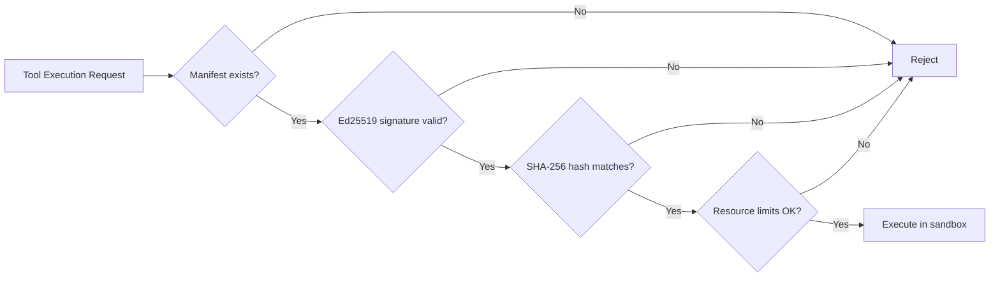

# Security Features

!!! info "v1.1.0"
    These features ship with CodeTether Agent v1.1.0. They are implemented in Rust and cannot be disabled.

CodeTether treats security as non-optional infrastructure. Four security controls are built into the agent runtime:

| Control | Module | Description |
|---------|--------|-------------|
| **Mandatory Auth** | `src/server/auth.rs` | Bearer token on every endpoint. Cannot be disabled. |
| **Audit Trail** | `src/audit/mod.rs` | Append-only log of every action. Queryable. |
| **Plugin Sandboxing** | `src/tool/sandbox.rs` | Ed25519-signed manifests, resource limits. |
| **K8s Self-Deployment** | `src/k8s/mod.rs` | Agent manages its own pods, scales, self-heals. |

---

## Mandatory Authentication

Every HTTP endpoint requires a Bearer token — except `/health`. This is enforced by a tower middleware layer that **cannot be conditionally removed**.

### How It Works

1. On startup, the server checks for `CODETETHER_AUTH_TOKEN` environment variable
2. If not set, it auto-generates an HMAC-SHA256 token from `hostname + timestamp`
3. The generated token is logged once at startup so operators can retrieve it
4. All requests without a valid `Authorization: Bearer <token>` header receive a `401` JSON error

### Configuration

| Variable | Default | Description |
|----------|---------|-------------|
| `CODETETHER_AUTH_TOKEN` | (auto-generated) | Set a fixed Bearer token for the API |

### Example

```bash
# With explicit token
export CODETETHER_AUTH_TOKEN="my-secure-token"
codetether serve --port 4096

# Authenticate requests
curl -H "Authorization: Bearer my-secure-token" http://localhost:4096/v1/cognition/status
```

### Exempt Endpoints

Only `/health` is accessible without authentication, for use with Kubernetes liveness/readiness probes.

---

## System-Wide Audit Trail

Every API call, tool execution, and session event is recorded in an append-only audit log.

### Architecture

- **Backend**: JSON Lines file (one JSON object per line, append-only)
- **Singleton**: Global `AUDIT_LOG` initialized once at server startup via `OnceCell`
- **Schema**: Each entry contains `id`, `timestamp`, `actor`, `action`, `resource`, `outcome`, `metadata`, `ip`, `session_id`

### API Endpoints

| Method | Endpoint | Description |
|--------|----------|-------------|
| `GET` | `/v1/audit/events` | List recent audit events |
| `POST` | `/v1/audit/query` | Query with filters |

### Query Filters

```json
{
  "actor": "user-123",
  "action": "tool.execute",
  "resource": "bash",
  "from": "2026-02-10T00:00:00Z",
  "to": "2026-02-10T23:59:59Z"
}
```

### Example

```bash
# List recent events
curl -H "Authorization: Bearer $TOKEN" http://localhost:4096/v1/audit/events

# Query by actor
curl -X POST -H "Authorization: Bearer $TOKEN" \
  -H "Content-Type: application/json" \
  -d '{"actor": "system"}' \
  http://localhost:4096/v1/audit/query
```

---

## Plugin Sandboxing & Code Signing

Tools (plugins) are verified before execution using cryptographic signing and resource sandboxing.

### Manifest System

Every tool has a `ToolManifest` containing:

| Field | Type | Description |
|-------|------|-------------|
| `tool_id` | `String` | Unique tool identifier |
| `version` | `String` | Semver version |
| `sha256_hash` | `String` | SHA-256 hash of the tool's content |
| `signature` | `String` | Ed25519 signature over the manifest |
| `allowed_resources` | `Vec<String>` | Filesystem paths/network hosts the tool may access |
| `max_memory_mb` | `u64` | Maximum memory allocation |
| `max_cpu_seconds` | `u64` | Maximum CPU time |
| `network_allowed` | `bool` | Whether network access is permitted |

### Verification Flow



### Sandbox Policies

| Policy | Description |
|--------|-------------|
| **Default** | Standard resource limits, network allowed |
| **Restricted** | Minimal resources, no network, limited filesystem |
| **Custom** | User-defined limits per tool |

### Signing a Tool Manifest

```bash
# Generate an Ed25519 keypair (one-time)
# The agent manages keys internally

# Register a signed manifest
curl -X POST -H "Authorization: Bearer $TOKEN" \
  -H "Content-Type: application/json" \
  -d '{
    "tool_id": "my_tool",
    "version": "1.0.0",
    "sha256_hash": "abc123...",
    "signature": "base64-ed25519-sig...",
    "max_memory_mb": 256,
    "max_cpu_seconds": 30,
    "network_allowed": false
  }' \
  http://localhost:4096/v1/tools/manifests
```

---

## Kubernetes Self-Deployment

When running inside a Kubernetes cluster, the agent manages its own lifecycle — creating deployments, scaling replicas, health-checking pods, and self-healing.

### Cluster Detection

The agent checks for `KUBERNETES_SERVICE_HOST` on startup. If present, it initializes the `K8sManager` with in-cluster configuration from the service account.

### Capabilities

| Operation | Method | Description |
|-----------|--------|-------------|
| **Detect cluster** | `detect_cluster()` | Check if running inside K8s |
| **Self info** | `self_info()` | Read pod metadata from Downward API |
| **Ensure deployment** | `ensure_deployment()` | Create or update the agent's Deployment |
| **Scale** | `scale(replicas)` | Adjust replica count |
| **Health check** | `health_check()` | Rolling restart of unhealthy pods |
| **Self-heal** | `self_heal()` | Comprehensive self-management |
| **Reconcile loop** | `reconcile_loop()` | Background task every 30 seconds |

### API Endpoints

| Method | Endpoint | Description |
|--------|----------|-------------|
| `GET` | `/v1/k8s/status` | Current cluster and pod status |
| `POST` | `/v1/k8s/scale` | Scale deployment replicas |
| `POST` | `/v1/k8s/health` | Trigger health check |
| `POST` | `/v1/k8s/reconcile` | Trigger reconciliation |

### Example

```bash
# Check cluster status
curl -H "Authorization: Bearer $TOKEN" http://localhost:4096/v1/k8s/status

# Scale to 3 replicas
curl -X POST -H "Authorization: Bearer $TOKEN" \
  -H "Content-Type: application/json" \
  -d '{"replicas": 3}' \
  http://localhost:4096/v1/k8s/scale

# Trigger health check
curl -X POST -H "Authorization: Bearer $TOKEN" http://localhost:4096/v1/k8s/health
```

### Reconciliation Loop

When enabled, the agent runs a background reconciliation every 30 seconds:

1. Checks all pods in the deployment
2. Identifies unhealthy or crashed pods
3. Triggers rolling restarts for unhealthy pods
4. Logs all actions to the audit trail

---

## Security Model Summary

```
┌─────────────────────────────────────────────────────────┐
│                   codetether-agent                      │
│                                                         │
│  ┌──────────────┐  Every request passes through:        │
│  │ Auth Layer   │  Bearer token validation (mandatory)  │
│  └──────┬───────┘                                       │
│         │                                               │
│  ┌──────▼───────┐  Every action recorded:               │
│  │ Audit Layer  │  Append-only JSON Lines log           │
│  └──────┬───────┘                                       │
│         │                                               │
│  ┌──────▼───────┐  Tools verified before execution:     │
│  │ Sandbox      │  Ed25519 signed, SHA-256 hashed       │
│  └──────┬───────┘                                       │
│         │                                               │
│  ┌──────▼───────┐  Infrastructure self-manages:         │
│  │ K8s Manager  │  Deploy, scale, health-check, heal    │
│  └──────────────┘                                       │
└─────────────────────────────────────────────────────────┘
```
